# Infrastructure Automation — Multi-Region AWS Deployment

> **Competition Challenge** — Build, fix, and deploy a complete AWS infrastructure from scratch using Terraform, CI/CD with CodeDeploy, and a full observability stack spanning two AWS regions.

---

## Architecture Topology

```mermaid
flowchart TB
    classDef userStyle fill:#232F3E,stroke:#FF9900,color:#FF9900,font-weight:bold
    classDef githubStyle fill:#24292E,stroke:#586069,color:#ffffff,font-weight:bold
    classDef albStyle fill:#8C4FFF,stroke:#6B37E8,color:#ffffff,font-weight:bold
    classDef natStyle fill:#4A4A4A,stroke:#888888,color:#ffffff
    classDef ecsStyle fill:#C7131F,stroke:#9E0F18,color:#ffffff,font-weight:bold
    classDef rdsStyle fill:#0073BB,stroke:#005A94,color:#ffffff,font-weight:bold
    classDef dynamoStyle fill:#4D27AA,stroke:#3A1E82,color:#ffffff,font-weight:bold
    classDef sqsStyle fill:#FF4F8B,stroke:#E0336D,color:#ffffff,font-weight:bold
    classDef ecrStyle fill:#FF9900,stroke:#CC7A00,color:#232F3E,font-weight:bold
    classDef ssmStyle fill:#DD344C,stroke:#B8293D,color:#ffffff
    classDef s3Style fill:#7AA116,stroke:#5F7D0F,color:#ffffff,font-weight:bold
    classDef cdStyle fill:#7CFC00,stroke:#5EA800,color:#232F3E,font-weight:bold
    classDef cwStyle fill:#E7157B,stroke:#C41068,color:#ffffff
    classDef snsStyle fill:#FF9900,stroke:#E68800,color:#232F3E,font-weight:bold
    classDef lambdaStyle fill:#FF9900,stroke:#CC7A00,color:#232F3E,font-weight:bold
    classDef promStyle fill:#E6522C,stroke:#CC4020,color:#ffffff,font-weight:bold
    classDef grafStyle fill:#F46800,stroke:#D05500,color:#232F3E,font-weight:bold
    classDef lokiStyle fill:#F9A825,stroke:#E09020,color:#232F3E,font-weight:bold
    classDef alertStyle fill:#D32F2F,stroke:#B71C1C,color:#ffffff,font-weight:bold

    subgraph INET["Internet"]
        direction LR
        User("User / Browser")
        GitHub("GitHub Repository")
    end

    subgraph USE1["us-east-1 N.Virginia - Application VPC 10.0.0.0/16"]
        direction TB

        subgraph PUB["Public Subnets 10.0.1-2.0/24"]
            ALB("ALB - Application Load Balancer\nlks-alb :80")
            NAT("NAT Gateway")
        end

        subgraph PRIV["Private Subnets 10.0.3-4.0/24 - ECS Cluster lks-ecs-cluster"]
            FE("lks-fe-service\nFlask Frontend :3000")
            API("lks-api-service\nFlask REST API :8080 / metrics :9100")
            ANA("lks-analytics-service\nFastAPI Stats :5000 / metrics :9100")
        end

        subgraph ISO["Isolated Subnets 10.0.5-6.0/24"]
            RDS[("Amazon RDS\nPostgreSQL 15 :5432")]
            DDB[("Amazon DynamoDB\nlks-sessions")]
            SQS("Amazon SQS\nlks-event-queue")
        end

        subgraph SUP["Support Services"]
            ECR1("Amazon ECR\nus-east-1")
            SSM("SSM Parameter Store\n/lks/app/*")
            S3("Amazon S3\ntfstate + assets")
            CD("AWS CodeDeploy\nBlue/Green ECS")
            CW("CloudWatch\nLogs + Alarms")
            SNS("Amazon SNS\nlks-cloudwatch-alerts")
            LAMBDA("Lambda\nlks-alertmanager-bridge")
        end
    end

    subgraph USW2["us-west-2 Oregon - Monitoring VPC 10.1.0.0/16 no IGW"]
        direction TB

        subgraph MPRIV["Private Subnets 10.1.1-2.0/24 - ECS Cluster lks-monitoring-cluster"]
            PROM("Prometheus\n:9090")
            GRAF("Grafana\n:3000")
            LOKI("Grafana Loki\n:3100")
            ALERT("Alertmanager\n:9093")
        end

        ECR2("Amazon ECR\nus-west-2")
    end

    User -->|"HTTP :80"| ALB
    ALB -->|"default /*"| FE
    ALB -->|"/api/*"| API
    ALB -->|"priority 1 /api/stats/*"| ANA

    FE & API & ANA -->|"SQL :5432"| RDS
    API -->|"publish event"| SQS
    ANA -->|"poll events"| SQS
    API -->|"write session"| DDB
    API & ANA -->|"read config"| SSM

    FE & API & ANA -->|"stdout logs"| CW
    CW -->|"alarm state change"| SNS
    SNS -->|"trigger"| LAMBDA
    LAMBDA -->|"POST /api/v1/alerts\nvia VPC Peering"| ALERT

    GitHub -->|"git push main"| CD
    CD -->|"blue/green deploy"| FE & API & ANA
    FE & API & ANA -->|"docker pull"| ECR1

    PROM -->|"scrape :9100 pcx-lks-2026"| API
    PROM -->|"scrape :9100 pcx-lks-2026"| ANA
    PROM -->|"fire alerts"| ALERT
    PROM -->|"metrics feed"| GRAF
    LOKI -->|"log feed"| GRAF
    FE & API & ANA -->|"ship logs pcx-lks-2026"| LOKI

    PROM & GRAF & LOKI & ALERT -->|"docker pull"| ECR2

    class User userStyle
    class GitHub githubStyle
    class ALB albStyle
    class NAT natStyle
    class FE,API,ANA ecsStyle
    class RDS rdsStyle
    class DDB dynamoStyle
    class SQS sqsStyle
    class ECR1,ECR2 ecrStyle
    class SSM ssmStyle
    class S3 s3Style
    class CD cdStyle
    class CW cwStyle
    class SNS snsStyle
    class LAMBDA lambdaStyle
    class PROM promStyle
    class GRAF grafStyle
    class LOKI lokiStyle
    class ALERT alertStyle
```



---

## Repository Structure

```
infraautomation/
├── frontend/              Python Flask — serves the web UI (port 3000)
├── api/                   Python Flask REST API — CRUD + SQS events (port 8080 / metrics 9100)
├── analytics/             Python FastAPI — stats + Prometheus metrics (port 5000 / metrics 9100)
├── monitoring/            Full observability stack configurations
│   ├── prometheus/        Scrape config + alerting rules
│   ├── grafana/           Dashboard provisioning
│   ├── loki/              Log aggregation config
│   ├── alertmanager/      Alert routing and notification config
│   └── Dockerfile         Builds monitoring image with configs baked in
├── terraform/             Infrastructure as Code — write all modules from scratch
│   ├── backend.tf         Terraform version + provider constraints
│   ├── variables.tf       All input variable declarations
│   ├── main.tf            Root module: two providers + six module calls
│   ├── outputs.tf         Exported values used in ECS and pipeline setup
│   └── modules/
│       ├── vpc/           Application VPC (us-east-1)
│       ├── security/      Security groups for all tiers
│       ├── alb/           ALB + Target Groups + Listener rules
│       ├── database/      RDS, DynamoDB, SQS, SSM, S3, CloudWatch
│       ├── s3/            S3 buckets (state + assets)
│       └── monitoring_vpc/ Monitoring VPC (us-west-2, no IGW)
└── .github/
    ├── SETUP.md           Repository setup and secrets guide
    └── workflows/
        └── lks-cicd.yml   CI/CD pipeline — fix the bugs to make it pass
```

---

## Inter-Region Peering Reference

| Behaviour | Same-Region | Inter-Region (this project) |
|---|---|---|
| `peer_region` required | No | **Yes** |
| `auto_accept` | Works | **Not supported — use `aws_vpc_peering_connection_accepter`** |
| DNS resolution | Supported | **Not supported — use private IPs only** |
| Encryption | Optional | **Automatic** |
| ECR | One registry | **One per region** |

---

## Tasks

> **Instructions:** Complete the tasks below in order. Read each service's `README.md` for context.
> Tasks are intentionally open-ended — you must understand the application flow to figure out the missing pieces.

---

### Task 1 — Provision Infrastructure with Terraform

Write all Terraform modules from scratch. The `terraform/` directory contains the root files (`main.tf`, `variables.tf`, `outputs.tf`, `backend.tf`) — study them carefully to understand what each module must expose.

- Implement all six modules: `vpc`, `security`, `alb`, `database`, `s3`, `monitoring_vpc`
- Each module must have `main.tf`, `variables.tf`, and `outputs.tf`
- Read `terraform/modules/*/README.md` for the resource list and required outputs of each module
- Fill in `terraform.tfvars` from the example file, then run `terraform apply`

> The outputs from this step (subnet IDs, security group IDs, ALB DNS, target group ARNs) are needed for all subsequent tasks.

---

### Task 2 — Fix Application Bugs

The application services contain deliberate bugs. Find and fix all of them before building Docker images.

Services to inspect:
- `api/` — Python Flask REST API
- `frontend/` — Python Flask frontend
- `analytics/` — Python FastAPI analytics service

> **Hint:** Check environment variable names, database connection settings, missing transaction commits, and metrics configuration. Run the services locally with `docker compose up -d` to observe failures.

---

### Task 3 — Build ECR Repositories and Push Images

Before the CI/CD pipeline can run, the ECR repositories must exist. Create them in both regions.

Application images (us-east-1):
- `lks-fe-app`
- `lks-api-app`
- `lks-analytics-app`

Monitoring images (us-west-2):
- `lks-prometheus`
- `lks-grafana`
- `lks-loki`
- `lks-alertmanager`

---

### Task 4 — Fix and Run the CI/CD Pipeline

The GitHub Actions workflow in `.github/workflows/lks-cicd.yml` contains deliberate bugs. Find and fix all of them so all pipeline jobs pass.

The pipeline must:
1. Install Python dependencies and run import smoke tests
2. Build and push application Docker images to ECR us-east-1
3. Build and push monitoring Docker images to ECR us-west-2
4. Upload deployment metadata to S3
5. Run `terraform validate` and `terraform plan`

Configure the required GitHub Secrets listed in `.github/SETUP.md`.

> **Hint:** Check job dependencies (`needs:`), Python version consistency, environment variable references, and secret names.

---

### Task 5 — Deploy Application Services via CodeDeploy

Set up AWS CodeDeploy to deploy the application ECS services. GitHub Actions must trigger a CodeDeploy deployment on every push to `main`.

#### 5a — ECS Cluster and Services

Create an ECS cluster named `lks-ecs-cluster` in us-east-1. Deploy three services using Fargate:

| Service | Image | Port | Target Group |
|---|---|---|---|
| `lks-fe-service` | `lks-fe-app:latest` | 3000 | `lks-tg-fe` |
| `lks-api-service` | `lks-api-app:latest` | 8080 | `lks-tg-api` |
| `lks-analytics-service` | `lks-analytics-app:latest` | 5000 | `lks-tg-analytics` |

Each service must be placed in the private subnets with the `lks-sg-ecs` security group. Environment variables must be injected from SSM Parameter Store, not hardcoded.

#### 5b — CodeDeploy Application

Create a CodeDeploy application with deployment type **ECS**. For each service, create a Deployment Group with:
- Deployment strategy: **Blue/Green**
- Load balancer: `lks-alb`, listener port `80`
- Production traffic listener routes to the target group
- Replacement task set is tested before traffic shifts

#### 5c — GitHub Actions → CodeDeploy Integration

The existing pipeline in `.github/workflows/lks-cicd.yml` builds and pushes images but **does not deploy** anything.
Your task is to add a new job named `codedeploy` to that file.

The new job must:
- Run only after **both** ECR build jobs have completed successfully (`needs: [build_and_push_ecr, upload_to_s3]`)
- For each of the three services (`lks-fe-service`, `lks-api-service`, `lks-analytics-service`):
  1. Register a **new ECS Task Definition revision** that points the container image to the newly pushed tag (`${{ github.sha }}`)
  2. Trigger a **CodeDeploy deployment** using the new task definition ARN

The deployment revision must be passed as `AppSpecContent` inline (not from an S3 file).
The AppSpec must specify:
- The new task definition ARN
- The container name and port matching the target group

Required GitHub Secrets (add these in your repository settings):

| Secret | Value |
|---|---|
| `CODEDEPLOY_APP_NAME` | Your CodeDeploy application name |
| `CODEDEPLOY_DG_FRONTEND` | Deployment group name for `lks-fe-service` |
| `CODEDEPLOY_DG_API` | Deployment group name for `lks-api-service` |
| `CODEDEPLOY_DG_ANALYTICS` | Deployment group name for `lks-analytics-service` |


---

### Task 6 — Deploy Monitoring Stack

Deploy the full observability stack in the us-west-2 ECS cluster (`lks-monitoring-cluster`). The monitoring services run in `lks-monitoring-vpc` and communicate with application services through Inter-Region VPC Peering.

#### 6a — VPC Peering

Establish Inter-Region VPC Peering between `lks-vpc` (us-east-1) and `lks-monitoring-vpc` (us-west-2). Both sides of the peering must be accepted and routes must be added to both route tables so traffic can flow bidirectionally.

> Remember: DNS resolution does not work over inter-region peering. All cross-region communication must use private IP addresses.

#### 6b — Monitoring ECS Cluster and Services

Create a cluster named `lks-monitoring-cluster` in us-west-2. Deploy four Fargate services:

| Service | Image | Port |
|---|---|---|
| `lks-prometheus` | `lks-prometheus:latest` | 9090 |
| `lks-grafana` | `lks-grafana:latest` | 3000 |
| `lks-loki` | `lks-loki:latest` | 3100 |
| `lks-alertmanager` | `lks-alertmanager:latest` | 9093 |

All services must use the `lks-sg-monitoring` security group and be placed in `lks-monitoring-vpc` private subnets.

#### 6c — Update Prometheus Scrape Targets

After ECS application services are running, retrieve their private IP addresses and update `monitoring/prometheus/prometheus.yml`. Push to GitHub to rebuild the monitoring image with the correct targets.

Prometheus must scrape the following jobs via the peering connection:
- `lks-api-service` at port `9100`
- `lks-analytics-service` at port `9100`

#### 6d — Grafana Data Sources and Dashboards

Configure Grafana with:
- **Prometheus** data source pointing to `http://<prometheus-private-ip>:9090`
- **Loki** data source pointing to `http://<loki-private-ip>:3100`
- A dashboard showing at least: request rate, error rate, and uptime for both `lks-api-service` and `lks-analytics-service`

#### 6e — Log Shipping to Loki

Application containers must ship their logs to Loki. Configure the ECS task definitions or a log driver so that logs from `lks-fe-service`, `lks-api-service`, and `lks-analytics-service` appear in Loki and are queryable in Grafana.

#### 6f — Alertmanager

Update `monitoring/alertmanager/alertmanager.yml` — replace the placeholder webhook URL (`http://localhost:9999/webhook`) with the actual URL of your Lambda webhook function (see Task 6g). Rebuild and redeploy the Alertmanager ECS service.

Confirm end-to-end alerting works:
- Trigger a Prometheus alert (e.g. stop a service so `APIServiceDown` fires)
- Alert appears in Alertmanager UI at `:9093`
- Notification is delivered via the webhook → Lambda → SNS chain

#### 6g — CloudWatch → Alertmanager Integration

The diagram shows CloudWatch sending metric alarms to Alertmanager. Because Alertmanager runs in a **private subnet** in us-west-2, it is not directly reachable from CloudWatch or SNS. The integration requires a Lambda function as a bridge.

**Architecture:**

```
CloudWatch Metric Alarm
        │
        ▼ (alarm state change)
   Amazon SNS Topic  (lks-cloudwatch-alerts)
        │
        ▼ (triggers)
   Lambda Function   (lks-alertmanager-bridge)
        │  runs inside lks-monitoring-vpc or with VPC config
        ▼ (HTTP POST via VPC Peering)
   Alertmanager :9093  /api/v1/alerts
```

**What you need to set up:**

**1. CloudWatch Log Groups**

The ECS task definitions must log to CloudWatch. Create log groups for each service:
- `/ecs/lks-fe-app`
- `/ecs/lks-api-app`
- `/ecs/lks-analytics-app`

Set retention to 7 days. These are already defined in the Terraform `database` module — verify they are applied.

**2. CloudWatch Metric Alarms**

Create at least the following alarms in us-east-1:

| Alarm | Metric | Threshold | Action |
|---|---|---|---|
| `lks-alarm-cpu-high` | ECS CPUUtilization > 80% for 2 periods | `lks-ecs-cluster` / all services | Publish to SNS |
| `lks-alarm-5xx-rate` | ALB HTTPCode_Target_5XX_Count > 10/min | `lks-alb` | Publish to SNS |
| `lks-alarm-api-down` | HealthyHostCount < 1 for target group `lks-tg-api` | | Publish to SNS |

**3. SNS Topic**

Create a Standard SNS Topic named `lks-cloudwatch-alerts` in us-east-1. All CloudWatch alarms must send notifications to this topic when transitioning to `ALARM` state.

> You may also subscribe your email to this topic directly for a simpler notification path — but the Alertmanager bridge (step 4) is required for full integration.

**4. Lambda Bridge Function**

Write a Lambda function named `lks-alertmanager-bridge` that:
> **Starter Code:** A skeleton script is provided in `monitoring/lambda-bridge/lambda_function.py`. You only need to finish the `TODO` sections.

- Is triggered by SNS (`lks-cloudwatch-alerts` as event source)
- Receives a CloudWatch alarm state-change JSON payload from SNS
- Converts it to Alertmanager alert format and POSTs to `http://<alertmanager-private-ip>:9093/api/v1/alerts`
- Is configured with a VPC setting that gives it network access to `lks-monitoring-vpc` (or uses the peering route from `lks-vpc`)

The Alertmanager alert payload format:
```json
[
  {
    "labels": {
      "alertname": "<AlarmName from CloudWatch>",
      "severity": "critical",
      "source": "cloudwatch"
    },
    "annotations": {
      "summary": "<AlarmDescription>",
      "description": "<StateChangeTime> — <NewStateReason>"
    }
  }
]
```

**5. Update Alertmanager Config**

After deploying the Lambda, update `monitoring/alertmanager/alertmanager.yml`:
- Replace `http://localhost:9999/webhook` with the Lambda Function URL (or API Gateway URL)
- Rebuild and redeploy the `lks-alertmanager` ECS service

> **Key constraint:** The Lambda must be able to reach Alertmanager's private IP in us-west-2. Options:
> - Deploy Lambda inside `lks-monitoring-vpc` directly (add a Lambda subnet and SG)
> - Deploy Lambda in `lks-vpc` and route through VPC Peering to `10.1.0.0/16`

---

## Verification Checklist

| Check | Expected |
|---|---|
| `terraform output alb_dns_name` | Returns a valid DNS name |
| `curl http://<alb-dns>/api/health` | `{"status":"ok","db":"connected"}` |
| `curl http://<alb-dns>/api/stats/health` | `200 OK` |
| GitHub Actions pipeline | All jobs green |
| CodeDeploy console | Deployment status `Succeeded` |
| Prometheus Targets (`:9090`) | `lks-api-service` and `lks-analytics-service` show `UP` |
| Grafana dashboards (`:3000`) | Live graphs with real metrics |
| Loki query in Grafana | Application logs visible |
| Alertmanager (`:9093`) | Alerts listed, notifications delivered |
| CloudWatch Alarms (us-east-1) | Alarms exist and transition to `ALARM` when thresholds breached |
| Lambda bridge function | Invoked by SNS, POSTs to Alertmanager — check CloudWatch Logs for Lambda |

---

## Local Development

```bash
# Start all application services locally
docker compose up -d

# With monitoring stack (Prometheus local)
docker compose --profile monitoring up -d

# Access
open http://localhost:3000      # Frontend
curl http://localhost:8080/api/health  # API
curl http://localhost:9090      # Prometheus
```

See each service's `README.md` for debugging tips and environment variable details.

---

## Key Concepts Reference

| Topic | What to know |
|---|---|
| ECS Fargate | Serverless containers — no EC2 to manage; task definitions define image, ports, env vars, IAM role |
| CodeDeploy Blue/Green | Two task sets run simultaneously; traffic shifts after health checks pass; old set terminated |
| SSM Parameter Store | Secrets read at container startup via IAM role — never hardcode credentials in task definitions |
| Inter-region peering | Requires `peer_region`; use `aws_vpc_peering_connection_accepter`; routes must be added manually |
| Prometheus scraping | Uses private IPs (not DNS) across peering; TCP 9100 must be open from `10.1.0.0/16` |
| CloudWatch log groups | Must exist before ECS tasks start, or the task will fail to launch |
| `lifecycle ignore_changes` | Prevents Terraform from undoing manual Console changes mid-competition |
